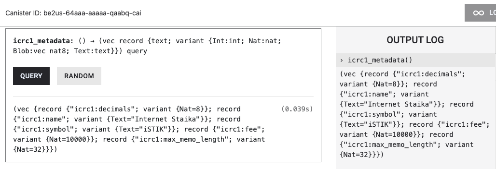

# `token_transfer`

## Install dfx SDK

```bash
sh -ci "$(curl -fsSL https://smartcontracts.org/install.sh)"
```

## Run dfx SDK

```bash
source "$HOME/Library/Application Support/org.dfinity.dfx/env"
```

## Create account

```bash
# create new account
dfx identity new ezt-test

# use created account
dfx identity use ezt-test
```

# Get PublicKey (principal Id)

```bash
dfx identity get-principal

# get private key
dfx identity export default

dfx ledger account-id
```

e.g) <br>
principal: t4uya-nraq2-cqwje-5quqq-e4tg6-c45ls-mmcjg-rsnz7-tto76-sta2t-wqe
account-id: 4aaa7568a5844fdb499fa246aac78e96f5b3cee5961ac32f6d197d5292435d25

# Running the project locally

```bash
dfx dfx start --background

# if you want to stop
dfx dfx stop
```

# Mint token 

```bash
# create minter

dfx identity new minter --storage-mode plaintext
dfx identity use minter
export MINTER=$(dfx identity get-principal)

```
<br>

```bash
dfx deploy icrc1_ledger_canister --argument "(variant { Init =
record {
     token_symbol = \"iSTIK\";
     token_name = \"Internet Staika\";
     minting_account = record { owner = principal \"${MINTER}\" };
     transfer_fee = 10_000;
     metadata = vec {};
     initial_balances = vec { record { record { owner = principal \"${DEFAULT}\"; }; 10_000_000_000; }; };
     archive_options = record {
         num_blocks_to_archive = 1000;
         trigger_threshold = 2000;
         controller_id = principal \"${MINTER}\";
     };
 }
})"
```
### The job completes!<br>
Application will be available at `http://localhost:4943?canisterId={asset_canister_id}`.<br>
e.g) <br>
http://127.0.0.1:4943/?canisterId=bnz7o-iuaaa-aaaaa-qaaaa-cai&id=be2us-64aaa-aaaaa-qaabq-cai
<br>

screenshot

